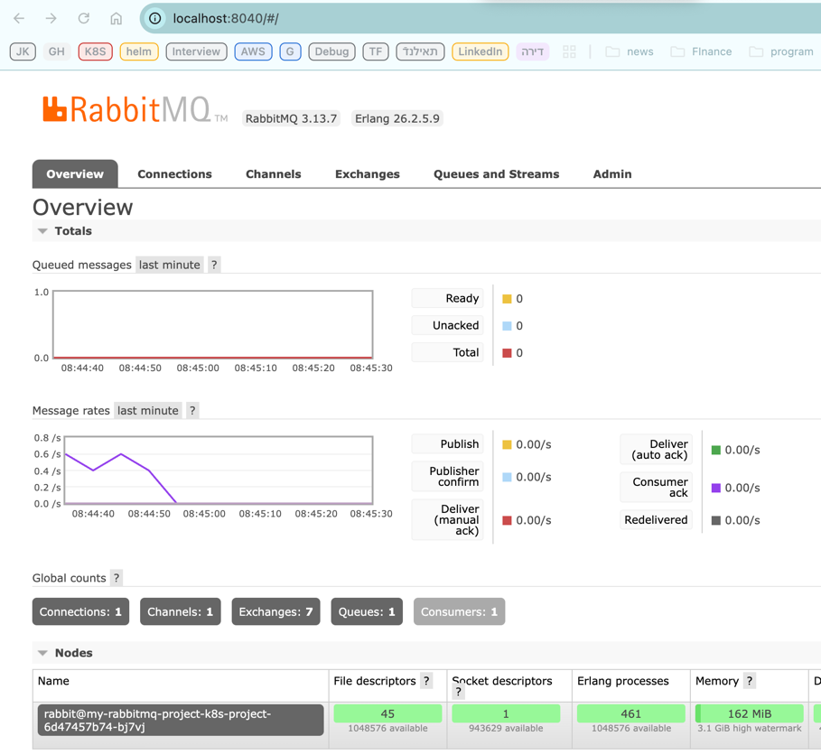
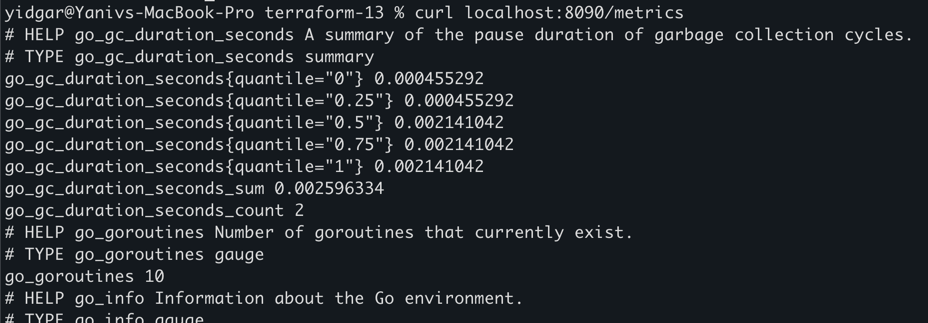

# k8s_project
## preparations 
```sh
alias k="kubectl"
export NS="k8s-project"

# Create the namespace 
k create ns k8s-project

# Install the RabbitMQ in the namespace 
helm install my-rabbitmq oci://registry-1.docker.io/bitnamicharts/rabbitmq -n $NS
```

Verify Rabbitmq is up 
```shell
# check using 
k get pods/my-rabbitmq-0 -n $NS
```


# Project Description


# Steps 
## 1. Install jenkins on Minikube with Agents (Docker, helm)
See details in k8s-jenkins-project/README.MD 

## 2. Create the k8s-project directory 
```shell
cd k8s_project
mkdir k8s-project 
```

## 3. Build the helm files 
### 3.1. create a template (in k8s_project) 
```shell
helm create k8s-project 
```
### 3.2. Update the helm template
In the k8s-project directory , populate  k8s yaml files of deployment, service etc'` 
Use the images created in the CI pipeline (uploaded to github):
- yidgar11/consumer:1.0 
- yidgar11/producer:1.0 

To check the outcome of the templates files 
```shell
cd k8s_project # if needed 
helm template k8s-project .
```

## 3.3 Install the helm chart 
```shell
cd k8s_project # if needd 
helm install my-rabbitmq-project k8s-project
```

# 4. install rabbitmq exporter 
```shell
helm repo add prometheus-community https://prometheus-community.github.io/helm-charts
helm repo update
helm install k8s-project-exporter prometheus-community/prometheus-rabbitmq-exporter -n $NS
````

# 5. update the pipelines in Jenkinsfile and run the pipeline 
5.1 Update the Jenkinsfile with the CI and CD steps
5.2 run the pipeline and check that the project is deployed and working properly


# Appendix 
## To check the containers status in the pod
```shell
k get pod ${PODNAME} -n ${NS} -o jsonpath='{range .status.containerStatuses[*]}{"\nContainer: "}{.name}{"\nState: "}{.state}{"\nReady: "}{.ready}{"\n"}{end}'
```

# Push helm chart to Dockerhub
```shell
cd k8s-project 

# create a package 
helm package .
# this will create k8s-project-1.0.0.tgz

# push to dockerhub
helm push k8s-project-1.0.0.tgz oci://registry-1.docker.io/yidgar11/
```

# Verifications 

## 1. Run the CI


## 2. Run the CD 
Currently isssue with the helm install in the pipeline 
due to the fact that the Jenkins in installed in Minikube 

## 3. Check deployment 


## 4. check consumer get the messages 
```shell
k logs pod/my-rabbitmq-project-k8s-project-6d47457b74-rgv25 -n $NS -c consumer
```


## Check RabbitMQ UI
```shell
k port-forward service/rabbitmq-service -n $NS 8040:15672
```
run in browser localhost:8040


# Check the RabbitMq exporter service metrics : 
```shell
k port-forward service/k8s-project-exporter-prometheus-rabbitmq-exporter -n $NS 8090:9419
curl localhost:8090/metrics
```



# Appendix
## RabbitMQ
### get the rabbitmq password (user=user) 
```shell
kubectl get secret --namespace k8s-project my-rabbitmq -o jsonpath="{.data.rabbitmq-password}" | base64 -d
``` 


### To Access the RabbitMQ Management interface:
```shell
# URL : http://127.0.0.1:15672/
kubectl port-forward --namespace k8s-project svc/my-rabbitmq 15672:15672
```

